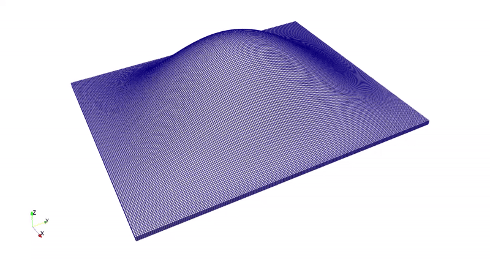
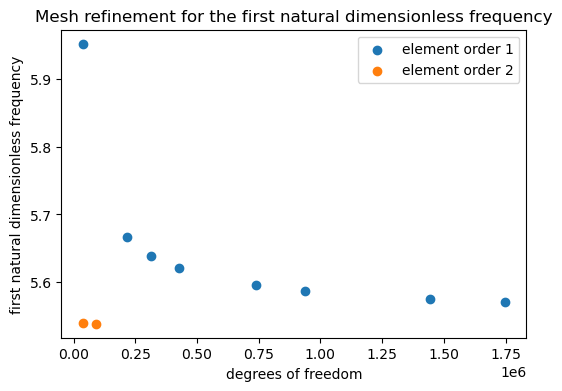

# FEniCSx tutorial: Free Vibrations of a Rectangular Thin Plate (Clamped on 4 edges)

In this tutorial, we will learn about the free vibrations of a rectangular thin plate.


## Table of Contents

* [Installation Instructions](#install)
* [Problem: Free Vibrations of a Rectangular Thin Plate](#problem)
* [Mesh Refinement](#refine)
* [Failure Example](#fail)


## Installation Instructions <a name="install"></a>

To use the codes in this tutorial, please begin by setting up FEniCSx:
```bash
mamba create --name fenicsx-env
mamba activate fenicsx-env
mamba install -c conda-forge fenics-dolfinx openmpi pyvista
```

When running the code for the first time, VSCode will prompt you to install ipykernel, necessary to run Jupyter Notebook.


## Problem: Free Vibrations of a Rectangular Thin Plate <a name="problem"></a>

Due to the importance of understanding vibration in different structures and systems, researchers have studied the problems of [thin plate vibrations](https://en.wikipedia.org/wiki/Vibration_of_plates) extensively. Previously, [Graff](https://store.doverpublications.com/products/9780486667454) could summarize the exact normal modes and frequencies for rectangular thin plates with at least two simply supported opposite edges using a series of equations. However, the exact solutions for other configurations (e.g., all 4 edges clamped) were not obtained until [Xing and Liu](https://link.springer.com/article/10.1007/s10409-008-0208-4) in 2009.

Here, we want to compute the first 6 natural frequencies and normal modes for a thin, homogeneous, isotropic, rectangular plate with clamps on 4 sides. We will compare our solutions with the analytical solution provided by Xing and Liu. The tutorial for this problem is located in ``tutorials\rectangular_thin_plate_vibration.ipynb``.

The results for the lowest 6 natural frequencies and corresponding normal modes are displayed below.



## Mesh Refinement <a name="refine"></a>

To perform mesh refinement, we used the codes given in the ``tutorials`` folder, and increased the degrees of freedom of the mesh while keeping the aspect ratio of the elements as close to 1 as possible. Then, we change the element order from 1 to 2, and repeat the same refinement process.

Here, we plot the first natural dimensionless frequency against degrees of freedom. The exact solution for this problem is 5.49, and the FEA value from Xing and Liu is 5.54.

<p align = "center">

</p>

For element order 1, the value is still converging as we increase the degrees of freedom. It's possible that the natural frequency is still converging with a higher mesh size. For element order 2, the computed value is about 5.54, which matches the FEA solution from the research paper. With more time and computational power, we would keep refining until we find a converged solution, even though our current solution might suffice.

## Failure Example <a name="fail"></a>

Typically, when solving for a vibration problem constrained by Dirichlet boundary conditions, the lowest natural frequencies might contain spurious near-zero frequency modes. In our code, during the matrices assembly step, we set the diagonals of these matrices to an arbitrarily high value (for K) and low value (for M) in order to shift the spurious answers to higher frequencies and prevent ill-conditioned matrices. 

```python
# Using the "diagonal" kwarg ensures that Dirichlet BC modes will not be among
# the lowest-frequency modes of the beam. 
K = assemble_matrix(fem.form(k_form), bcs=bcs, diagonal=62831)
M = assemble_matrix(fem.form(m_form), bcs=bcs, diagonal=1/62831)
K.assemble()
M.assemble()
```

To create less meaningful results (natural frequencies near 0), we can simply set the diagonals to 1. Below, we show the results for the first 6 frequencies with the matrix diagonals set to 1.

```python
Number of converged eigenpairs 9
Mode 0: 0.18050825
Mode 1: 0.18050825
Mode 2: 0.18050825
Mode 3: 0.18050825
Mode 4: 0.18050825
Mode 5: 0.18050825
```
